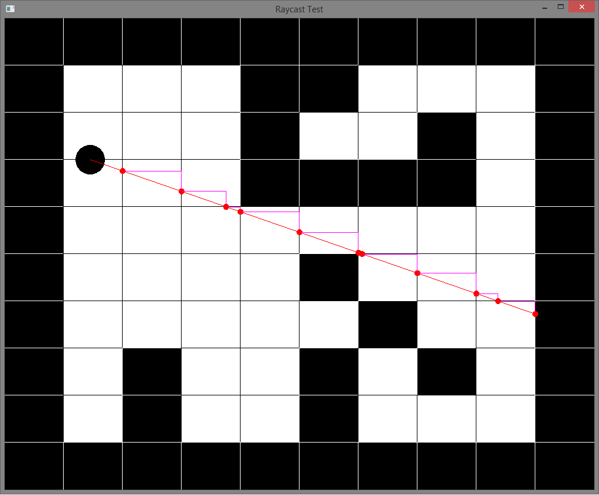
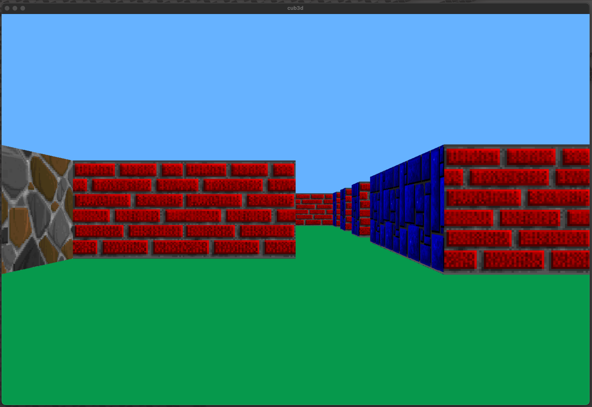
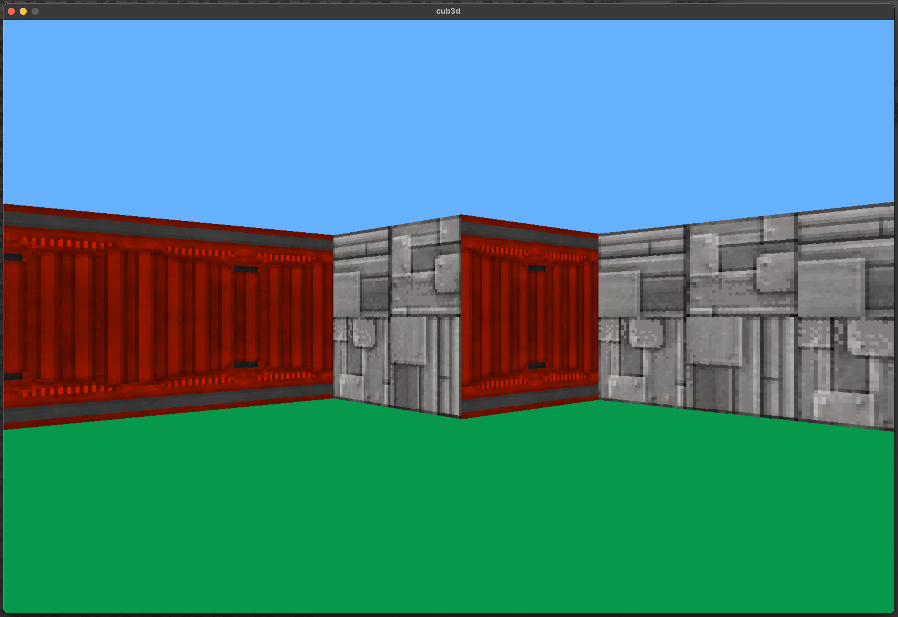

# Cub3D 

Cub3D is a project that uses the raycasting algorithm to create a 3D-looking world on a 2D map. This project includes a basic raycasting engine that allows the player to navigate a maze. Below, you will find detailed information on the essential components of the project, including the algorithms and structures used.

## Table of Contents
- [Cub3D](#cub3d)
	- [Table of Contents](#table-of-contents)
	- [What is Raycasting?](#what-is-raycasting)
		- [Raycasting Diagram](#raycasting-diagram)
	- [How Raycasting Works](#how-raycasting-works)
	- [DDA Algorithm](#dda-algorithm)
		- [DDA Algorithm Diagram](#dda-algorithm-diagram)
	- [Direction Vectors](#direction-vectors)
		- [Direction Vectors Diagram](#direction-vectors-diagram)
	- [Project Details](#project-details)
	- [Map File Structure](#map-file-structure)
		- [Map Components:](#map-components)
		- [Example Map File:](#example-map-file)
		- [Explanation:](#explanation)
		- [Map Validation:](#map-validation)
	- [Screenshots](#screenshots)
	- [Installation](#installation)
	- [Usage](#usage)

## What is Raycasting?

**Raycasting** is a technique that simulates the casting of rays from a player’s perspective in a 2D space to determine where those rays hit walls or obstacles. This method is used to create a simplified 3D projection of a scene by calculating the distance each ray travels before hitting a surface. It was famously used in early games like Wolfenstein 3D.

In raycasting, each ray is traced from the player’s point of view, and the first obstacle hit by the ray is determined. The distance of this intersection is then used to draw vertical lines (representing walls) on the screen, creating the illusion of a 3D space.

### Raycasting Diagram


## How Raycasting Works

Cub3D uses the raycasting algorithm to allow the player to navigate a 2D maze while rendering the map in a 3D perspective. Rays are cast in the direction the player is facing, and for each ray, the algorithm determines where it hits a wall. Based on the distance to the wall, the height of the wall is drawn on the screen.

As the player moves, the direction vectors of the rays are updated, and the scene is redrawn to reflect the new perspective.

## DDA Algorithm

The **DDA (Digital Differential Analyzer)** algorithm is a key part of the raycasting process. It calculates how a ray moves through the grid and determines which wall it hits. The algorithm works by stepping through the grid one cell at a time, checking for collisions with walls.

### DDA Algorithm Diagram



Steps of the DDA algorithm:
1. Calculate the initial position of the ray.
2. Determine the step size for each axis (x and y).
3. Move the ray through the grid, checking for wall collisions, until a hit is detected.

## Direction Vectors

Direction vectors control the player’s movement and view direction. The player’s forward and backward movement, as well as their rotation, are defined by these vectors. The player’s direction is constantly updated based on input, which in turn adjusts the angle and distance of the rays cast from the player’s position.

### Direction Vectors Diagram


## Project Details

Cub3D is a first-person view project where a player can explore a maze generated on a 2D map. The project utilizes:
- **Raycasting**: To create a pseudo-3D environment from a 2D grid.
- **DDA Algorithm**: To determine the points where rays hit walls.
- **Textures**: To add realism to the 3D walls by applying images to surfaces.
  
The player can move forward, backward, and rotate to change their field of view. The game constantly updates the visual display to reflect the player’s position and orientation.

## Map File Structure

The map file (`.cub` extension) defines the layout of the maze and other game parameters. It is a plain text file where each character represents a different element of the game world.

### Map Components:
- **Walls (`1`)**: Represent solid walls that the player cannot pass through.
- **Empty space (`0`)**: Open areas where the player can move.
- **Player start position (`N`, `S`, `E`, `W`)**: The player's initial position and orientation (North, South, East, West).
- **Textures and settings**: The first part of the `.cub` file contains paths to textures and color settings for the floor and ceiling.

### Example Map File:

```
NO ./textures/wall_north.xpm
SO ./textures/wall_south.xpm
WE ./textures/wall_west.xpm
EA ./textures/wall_east.xpm

F 220,100,0 // Floor color (RGB format)
C 225,30,0 // Ceiling color (RGB format)

1111111111
1000000001
1000000001
100N000001
1111111111
```

### Explanation:
- **Textures**: The first section defines the paths to the texture files used for the north, south, west, and east walls.
- **Floor and ceiling colors**: These lines define the color of the floor and ceiling in RGB format.
- **Map layout**: The grid of numbers (1s and 0s) defines the layout of the walls and open spaces in the game. The player starts at position `N` (facing north in this example).

The map must be surrounded by walls (`1`s) to ensure that the player cannot escape the boundaries of the game world.

### Map Validation:
- Ensure the map is a closed rectangular grid.
- The player should have only one starting position.
- Textures and colors must be defined before the map layout begins.


## Screenshots

Here are some screenshots showing the gameplay and rendering:





## Installation

1. Clone the repository:
    ```bash
    git clone https://github.com/cantasar/cub3D.git
    ```
2. Navigate to the project directory:
    ```bash
    cd cub3d
    ```
3. Compile the project:
    ```bash
    make
    ```

## Usage

Run the game using the following command:
```bash
./cub3D map.cub
```

Use the following keys to control the player:

W/A/S/D: Move forward, left, backward, right.

Arrow Keys: Rotate the view.

ESC: Exit the game.
